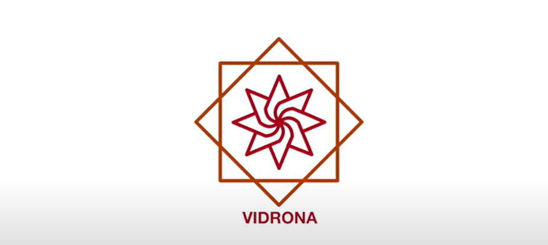

<br><br>


# Vidrona - IoT-Based Utility Monitoring System

Vidrona is an AI-powered utility monitoring system that uses IoT devices, Fog and Edge computing, and cloud services to monitor and analyze real-time data from various sensors. The system integrates AWS services for cloud storage, we can use Kafka for stream processing, and Streamlit for visualization on a web dashboard.

[](#)
[](#)
[](#))
[](#)
[](#)

# Who are We?
[](https://www.youtube.com/watch?v=yPIS7ShKdms&autoplay=1)

## 🚀 Features

- 🌐 **Real-Time Monitoring**: Continuously monitor environmental data from IoT sensors (e.g., temperature, humidity).
- 🌩️ **Edge/Fog Processing**: Process sensor data locally on Edge/Fog nodes to reduce latency.
- ☁️ **Cloud Integration**: Leverage AWS services (DynamoDB, Lambda, etc.) for cloud storage and processing.
- 📊 **Dashboard Visualization**: Visualize real-time sensor data using a Streamlit dashboard.
- 🔒 **Data Security**: Secure communication and storage using AWS IAM roles and encryption.

## 🛠️ Tech Stack

### Core Technologies

- **Python**: The main programming language for automation and integration.
- **AWS**: Utilizes various AWS services including DynamoDB, Lambda, and EC2 for cloud computing.
- **MQTT**: Messaging protocol for communication between IoT devices and cloud.
- **Streamlit**: Framework for building interactive dashboards to visualize real-time data.
- **paho-mqtt**: MQTT client for communication between Edge/Fog and Cloud.

## 📋 Installation

```bash
# Clone the repository
git clone https://github.com/PacemakerX/Vidrona.git
cd Vidrona

# Set up virtual environment
python -m venv venv
source venv/bin/activate  # On Windows: venv\Scripts\activate

# Install dependencies
pip install -r requirements.txt

# Configure aws configuration
cp .aws_config.json.example aws_config.json
# Edit .env with your API keys and settings

```

## 🔧 Configuration

### Requirements.txt

```
boto3==1.26.13
paho-mqtt==1.6.1
streamlit==1.10.0
pandas==1.4.2
matplotlib==3.5.2
seaborn==0.11.2
scikit-learn==1.1.0
numpy==1.23.1
pytz==2022.1
```

## 📝 Usage

```bash
# Run the main file
python main.py

```

## Link to the Repository:

<p align="center">
<a href="https://github.com/PacemakerX/Vidrona.git">
  
</a>
<p>

## Feel free to connect with me!

<p align="center">
  <a href="mailto:sparsh.officialwork@gmail.com">
    
  </a>
  <a href="https://www.linkedin.com/in/sparshsoni">
    
  </a>
</p>
